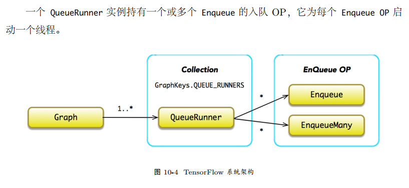

## 队列

* TensorFlow 的 Session 是线程安全的。也就是说，多个线程可以使用同一个 Session实例，并发地执行同一个图实例的不同 OP； 
TensorFlow 执行引擎会根据输入与输出对图实施剪枝，得到一个最小依赖的子图。
* 在 TensorFlow 的执行引擎中， Queue 是一种控制异步计算的强大工具。特殊地， Queue是一种特殊的 OP，与 Variable 类似，它是一类有状态的 OP。

* 为了使得队列在多线程最大化发挥作用，需要解决两个棘手的问题：
    1. 如何同时停止所有的线程，及其处理异常报告？  tf.train.Coordinator
    2. 如何并发地向队列中追加样本数据？  tf.train.QueueRunner
    * 这两个类相辅相成， Coordinator 协调多个线程同时停止运行，并且向等待停止通知的主程序报告异常；
    而 QueueRunner 创建了一组线程，并协作多个入队 OP(例如 Enqueue，EnqueueMany) 的执行


### 协调器

* Coordinator 提供了一种同时停止一组线程执行的简单机制。它拥有 3 个重要的方法：
    1. should_stop: 判断当前线程是否应该退出
    2. request_stop: 请求所有线程停止执行
    3. join: 等待所有线程停止执行
```
# 创建协调器
coord = tf.train.Coordinator()
# 创建10个线程来运行 'MyLoop()'
threads = [threading.Thread(target=MyLoop, args=(coord,)) for i in xrange(10)]
# 开启线性
for t in threads:
    t.start()
# 等待所有线程结束
coord.join(threads)
```
* 任何子线程，都可以通过调用 coord.request_stop，通知其他线程停止执行。因此，每个线程的迭代执行中，
都要事先检查 coord.should_stop()。一旦 coord.request_stop 被调用，其他线程的 coord.request_stop() 将立即返回 True
```
def MyLoop(coord):
    try
        while not coord.should_stop():
            # ...do something...
    except Exception as e:
        coord.request_stop(e)
```


### QueueRunner


* 可以调用 tf.train.start_queue_runners 时，它会从计算图中找到所有 QueueRunner实例，
并从 QueueRunner 实例中取出所有 Enqueue OP，为每个 OP 启动一个线程。
```
def start_queue_runners(sess, coord, daemon=True, start=True, collection=ops.GraphKeys.QUEUE_RUNNERS):
    with sess.graph.as_default():
        threads = []
        for qr in ops.get_collection(collection):
            threads.extend(qr.create_threads(sess, coord=coord, daemon=daemon, start=start))
        return threads
```
```
class QueueRunner(object):
    def create_threads(self, sess, coord, daemon, start):
        """Create threads to run the enqueue ops.
        """
        # 利用QueueRunner为每个线程线程run一个
        threads = [threading.Thread(target=self._run, args=(sess, op, coord)) for op in self._enqueue_ops]
        # 管理线程
        if coord:
            threads.append(threading.Thread(target=self._close_on_stop, args=(sess, self._cancel_op, coord)))
        for t in threads:
            if coord:
            coord.register_thread(t)
        if daemon:
            t.daemon = daemon
        if start:
            t.start()
        return threads
```
* 迭代执行 Enqueue: 每个 Enqueue 子线程将迭代执行 Enqueue OP。当发生 OutOfRangeError 异常时，将自动关闭队列，并退出子线程；
但是，如果发生其他类型的异常，会主动通知 Coordinator 停止所有线程的运行，并退出子线程。
```
class QueueRunner(object):
    def _run(self, sess, enqueue_op, coord):
        try:
            enqueue_callable = sess.make_callable(enqueue_op)
            while True:
            if coord.should_stop():
                break
            try:
                enqueue_callable()
            except errors.OutOfRangeError:
                sess.run(self._close_op)
                return
        except Exception as e:
            coord.request_stop(e)
```


