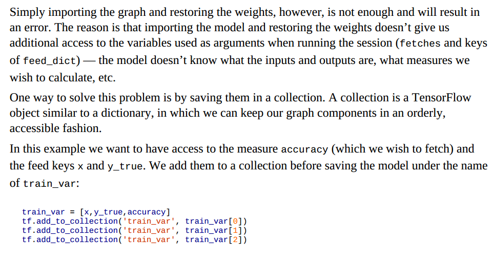

* 使用numpy方式
```
import numpy as np
weights = sess.run(W)
np.savez(os.path.join(path, 'weight_storage'), weights)

loaded_w = np.load(path + 'weight_storage.npz')
loaded_w = loaded_w.items()[0][1]

sess.run(W.assign(loaded_w))
```
* 使用内置的 save类
```
saver = tf.train.Saver(max_to_keep=7, keep_checkpoint_every_n_hours=0.5)

DIR = "path/to/model"
with tf.Session() as sess:
    for step in range(1,NUM_STEPS+1):
        if step % 50 == 0:
            saver.save(sess, os.path.join(DIR, "model"), global_step=step)  # 保存模型
            
            
    saver.restore(sess, os.path.join(DIR,"model_ckpt-1000"))  # 加载模型
```
* 注意


* 到目前为止， 所有方法为了加载参数都需要重建图. Saver也提供不重建的方式通过生成 .meta 文件保存了所有的需要的信息。



* 保存变量
```
saver = tf.train.Saver(max_to_keep=7, keep_checkpoint_every_n_hours=1)
saver.export_meta_graph(os.path.join(DIR,"model_ckpt.meta"), collection_list=['train_var'])
```
* 加载变量
```
with tf.Session() as sess:
    sess.run(tf.global_variables_initializer())
    saver = tf.train.import_meta_graph(os.path.join(DIR,"model_ckpt.meta")
    saver.restore(sess, os.path.join(DIR,"model_ckpt-1000"))
    
    x = tf.get_collection('train_var')[0]
    y_true = tf.get_collection('train_var')[1]
    accuracy = tf.get_collection('train_var')[2]