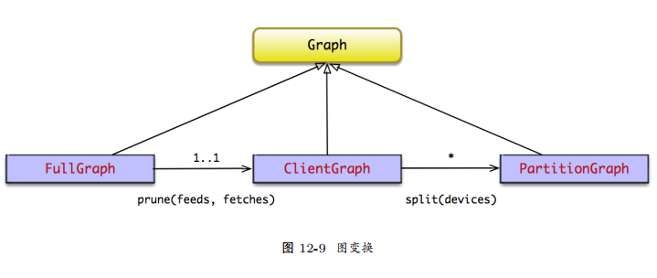

* DirectSession.Run 是 TensorFlow 运行时的关键路径，它负责完成一次迭代计算。
首先，DirectSession 根据输入/输出对 FullGraph 实施剪枝，生成 ClientGraph；
然后，根据所持有本地设备集，将 ClientGraph 分裂为多个 PartitionGraph；
运行时为其每个 PartitionGraph启动一个 Executor 实例，后者执行 PartitionGraph 的拓扑排序算法，完成计算图的执行。



* FullGraph: Client 负责构造的完整的计算图，常称为 FullGraph；但是，一次 Session.run 并不会执行整个计算图；

* ClientGraph: Master 根据 Session.run 传递 feeds, fetches 输入输出列表，
对 FullGraph 实施剪枝操作，计算得到本地迭代执行的最小依赖子图，常称为 ClientGraph；

* PartitionGraph: Master 根据当前计算设备集，及其 OP 的设备约束规范，将 ClientGraph 分裂为多个 PartitionGraph；
其中，每个计算设备对应一个 PartitionGraph，计算设备负责 PartitionGraph 的执行。

```
def do_run_partitions(executors_and_partitions):
    barrier = ExecutorBarrier(executors_and_partitions.size())
    for (executor, partition) in executors_and_partitions:
        executor.run(partition, barrier)
    barrier.wait()
    
def run_partitions(executors_and_partitions, inputs, outputs):
    frame = FunctionCallFrame()
    frame.set_args(inputs)
    do_run_partitions(executors_and_partitions)
    frame.get_ret_vals(outputs)
    
def run_step(devices, full_graph, inputs, outputs):
    client_graph = prune(full_graph, inputs, outputs)
    executors_and_partitions = split(client_graph, devices)
    run_partitions(executors_and_partitions, inputs, outputs)
```
* 在每个计算设备上，启动一个 Executor 执行分配给它的 PartitionGraph。
当某一个计算设备执行完所分配的 PartitionGraph 之后， ExecutorBarrier 的计数器加 1，直至所有设备完成 PartitionGraph 列表的执行，
barrier.wait() 阻塞操作退出。
* 跨设备的 PartitionGraph 之间可能存在数据依赖关系，它们之间通过插入 Send/Recv节点完成交互。
事实上，在本地模式中， Send/Recv 通过 Rendezvous 完成数据交换的。 Send将数据放在 Rendezvous 上，
而 Recv 则根据标识从 Rendezvous 取走。其中， Send 不阻塞，而 Recv 是阻塞的。