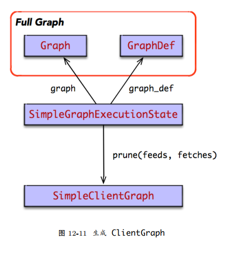

> 这里的剪枝应该是根据要求的节点，找到和相关的边，然后替换边的过程；

* DirectSession::Run 执行时，首先完成 ClientGraph 的构造。事实上， ClientGraph 的构造过程，
主要完成 FullGraph 的剪枝算法，并生成 ClientGraph。



```
BuildGraphOptions build_graph_options(const NamedTensorList& inputs, const std::vector<string>& outputs,
    const std::vector<string>& targets) {
    // sort inputs/outputs/targets
    std::vector<string> inputs_sorted(inputs.begin(), inputs.end());
    std::sort(inputs_sorted.begin(), inputs_sorted.end());
    std::vector<string> outputs_sorted(outputs.begin(), outputs.end());
    std::sort(outputs_sorted.begin(), outputs_sorted.end());
    std::vector<string> tn_sorted(targets.begin(), targets.end());
    std::sort(tn_sorted.begin(), tn_sorted.end());
    // build graph options
    BuildGraphOptions options;
    options.feed_endpoints = inputs_sorted;
    options.fetch_endpoints = outputs_sorted;
    options.target_nodes = tn_sorted;
    options.use_function_convention = !run_state_args->is_partial_run;
    return options;
}

Status DirectSession::Run(
    const RunOptions& run_options,
    const NamedTensorList& inputs,
    const std::vector<string>& output_names,
    const std::vector<string>& target_nodes,
    std::vector<Tensor>* outputs,
    RunMetadata* run_metadata) {
        // 1. prune graph
        // client_graph = prune(full_graph, inputs, outputs)
        std::unique_ptr<SimpleClientGraph> client_graph;
        execution_state_->BuildGraph(
        build_graph_options(inputs, output_names, target_nodes),
        &client_graph);
        // 2. split graph into partition by devices
        // executors_and_partitions = split(client_graph, devices)
        // 3. lauch executor per partition
        // def run_partitions(executors_and_partitions, inputs, outputs):
        // frame = FunctionCallFrame()
        // frame.set_args(inputs)
        // for (executor, partition) in executors_and_partitions:
        // exec.run(part)
        // frame.get_ret_vals(outputs)
        return Status::OK();
}
```
* ClientGraph 初始来自原始的 FullGraph，调用 RewriteGraphForExecution 函数，将根据输入/输出，对 ClientGraph 实施改写操作，
包括增加节点，或删除节点，最终生成SimpleClientGraph 实例;
```
const DeviceAttributes& SimpleGraphExecutionState::local_device_attr() const {
    return device_set_->client_device()->attributes();
}

Status SimpleGraphExecutionState::BuildGraph(const BuildGraphOptions& options, std::unique_ptr<SimpleClientGraph>* out) {
    // 1. create new_graph from origin graph, which is client graph.
    std::unique_ptr<Graph> ng;
    ng.reset(new Graph(flib_def_.get()));
    CopyGraph(*graph_, ng.get());
    
    // 2. prune the client graph
    subgraph::RewriteGraphForExecution(ng.get(), options.feed_endpoints, options.fetch_endpoints,
        options.target_nodes, local_device_attr(), options.use_function_convention);
    }
    
    // 3. create SimpleClientGraph, and return it.
    std::unique_ptr<SimpleClientGraph> dense_copy(new SimpleClientGraph(std::move(flib)));
    CopyGraph(*ng, &dense_copy->graph);
    *out = std::move(dense_copy);
    return Status::OK();
}
```
* 因此，构建 ClientGraph 过程，其关键路径为 RewriteGraphForExecution，即剪枝算法。
剪枝算法根据输入/输出列表，反向遍历 FullGraph，找到最小的依赖子图 ClientGraph。
一般地，对于 ClientGraph 输入节点，扮演了起始节点；而输出节点，扮演了终止节点。因此，关于输入和输出，存在两个比较棘手的问题
    1. 输入：当 ClientGraph 计算开始前，外部的运行时如何传递 Tensor 给输入节点；
    2. 输出：当 ClientGraph 计算完成后，外部的运行时又如何从输出节点获取 Tensor。
* 在两种媒介： FunctionCallFrame 和 Rendezvous，外部运行时与输入/输出节点可以使用其中一种媒介交换数据。
    1. FunctionCallFrame 用于 Arg/RetVal 函数调用的 OP，用于函数调用时传递函数参数值，及其返回函数值。但是，它们仅适用于单进程的运行时环境。
    2. Rendezvous 用于 Send/Recv 消息发送的 OP，这是一种更为通用的通信方式，适用于分布式的运行时环境;

