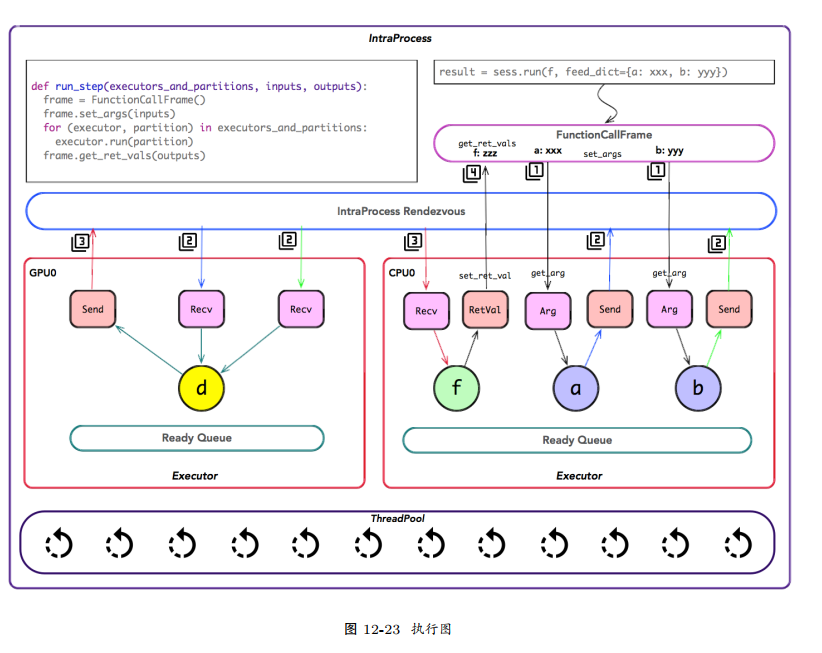

* 接下来，运行时将并发执行各个 PartitionGraph。每个PartitionGraph 启动一个 Executor，实现并发执行图的计算。
* 每个 Executor 将执行 PartitionGraph 的拓扑排序算法，将入度为 0 的 OP 追加到ready_queue 之中，并将其关联的 OP 的入度减 1。
调度器调度 ready_queue 之中 OP ，并将其放入 ThreadPool 中执行对应的 Kernel 实现。
* 在所有 Partition 开始并发执行之前，需要外部将其输入传递给相应的 Arg 节点；当所有 Partition 完成计算后，
外部再从 RetVal 节点中取走数据。其中， Arg/RetVal 节点之间的数据时通过 FunctionCallFrame 完成交互的。
* 如果 PartitionGraph 之间需要跨设备交换数据，生产者将其放在 Send 节点，消费者通过 Recv 节点获取数据。
其中，发送方不阻塞；接收方如果数据未到，则发生阻塞直至超时。此外， Send/Recv 节点之间的数据是通过 Rendezvous 完成交互的。

* 执行图计算需要解决如下 3 个核心问题：
    1. 输入/输出处理
    2. 设备间数据交换
    3. 执行 PartitionGraph
